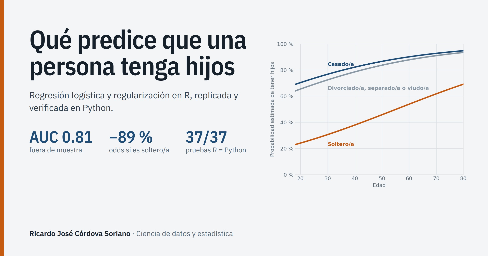

<a href="https://ricardocordova979.github.io/regresion-logistica-paternidad/">
  
</a>

# Qué predice que una persona tenga hijos


**[Ver el proyecto publicado](https://ricardocordova979.github.io/regresion-logistica-paternidad/)** ·
[Informe en R](https://ricardocordova979.github.io/regresion-logistica-paternidad/docs/informe-r.html) ·
[Informe en Python](https://ricardocordova979.github.io/regresion-logistica-paternidad/docs/informe-python.html) ·
[Verificación R vs. Python](https://ricardocordova979.github.io/regresion-logistica-paternidad/docs/verificacion.html)

Modelo de clasificación que estima la probabilidad de que una persona tenga hijos a partir de su perfil
sociodemográfico, con datos de 2,035 personas de la *General Social Survey* (EE. UU.). Desarrollado en **R** y
replicado en **Python**: un script automático confirma que ambas implementaciones coinciden en **51,860 valores**,
incluidas todas las particiones aleatorias y la validación cruzada fold a fold.

> **EN:** Binary classification of parenthood from sociodemographic data (2,035 GSS respondents). It covers
> automatic variable selection (stepwise, forward and backward with AIC and BIC), repeated cross-validation
> (5 folds × 20 repeats), odds-ratio interpretation, Type II ANOVA, and regularized models (LASSO, Ridge and Elastic
> Net) with joint α/λ tuning and the 1-SE rule. The full analysis was replicated in Python and verified on 51,860
> values. This required re-implementing R's RNG, caret's resampling, `step()` and `glmnet` from scratch.

## Resultados principales

| Hallazgo | Resultado |
|---|---|
| Factor dominante | Estado civil: las *odds* de tener hijos de una persona soltera son **un 89 % menores** que las de una casada. |
| Edad | Cada 10 años adicionales multiplican las *odds* por **1.42**. |
| Género | Los hombres declaran *odds* **un 50 % menores** que las mujeres. |
| Modelo recomendado | Logístico seleccionado por BIC (9 parámetros): **AUC = 0.813**, sensibilidad 82.9 % y especificidad 73.5 % en prueba. |
| Alternativa mínima | LASSO con solo estado civil y edad: AUC = 0.789. |
| Control negativo | El signo del zodiaco no fue seleccionado por ningún método. |

## Técnicas y herramientas

- **Estadística:** regresión logística, selección de variables (stepwise, forward y backward con AIC/BIC),
  validación cruzada repetida, AUC, Kappa, matriz de confusión, ANOVA de tipo II, *odds ratios*, LASSO, Ridge,
  Elastic Net y la regla 1-SE.
- **R:** `caret`, `car`, `pROC`, `glmnet`, `dplyr`, `ggplot2`, `gt` y R Markdown.
- **Python:** `statsmodels`, `pandas`, `numpy`, `scipy`, `matplotlib`, `great_tables` y Jupyter, más el módulo
  propio `rcompat.py`.

## El módulo `rcompat.py`

Python no tiene equivalentes directos de varias funciones de R. `Python/rcompat.py` las reimplementa y reproduce
sus resultados:

- el generador aleatorio de R (`set.seed()`, Mersenne-Twister y `sample()`);
- `caret::createDataPartition()`, `createFolds()`, `createMultiFolds()` y la semilla interna de `train()`;
- `step()` con AIC y BIC;
- `glm()` con el mismo algoritmo IRLS;
- `glmnet()` y `cv.glmnet()` para regresión logística penalizada.

## Estructura del repositorio

```
├── R/              R Markdown del análisis y su informe HTML
├── Python/         Script .py, notebook ejecutado (.ipynb), informe HTML y módulo rcompat.py
├── verificacion/   Comparación automática R vs. Python y resultados en JSON
├── reporte/        Informes en PDF (R, Python y verificación)
├── datos/          Conjunto de datos (formato .rds de R)
└── docs/           Página del proyecto publicada con GitHub Pages
```

## Cómo reproducirlo

**R (≥ 4.1):** instala `caret`, `car`, `pROC`, `glmnet`, `MLmetrics`, `dplyr`, `tidyr`, `purrr`, `ggplot2`, `gt` y
`rmarkdown`. Después abre `R/02_Regresion_Logistica_DatosGSS.Rmd` en RStudio y pulsa *Knit*.

**Python (≥ 3.10):**

```bash
pip install -r requirements.txt
cd Python
jupyter nbconvert --to notebook --execute 02_Regresion_Logistica_DatosGSS.ipynb
```

**Verificación de la replicación** (requiere `Rscript` en el PATH):

```bash
cd verificacion
python verificar_replicacion.py
```

## Datos

2,035 personas encuestadas en la *General Social Survey* (GSS) de Estados Unidos, con 13 variables: clase social,
felicidad, afiliación política, tamaño de la localidad, región, ingresos, raza, género, edad, estado civil, empleo,
signo del zodiaco y si tiene hijos (variable objetivo).
https://gss.norc.org/get-the-data.html

## Autor

**Ricardo José Córdova Soriano**, análisis estadístico y ciencia de datos con R y Python.
[Perfil de GitHub](https://github.com/ricardoCordova979)
